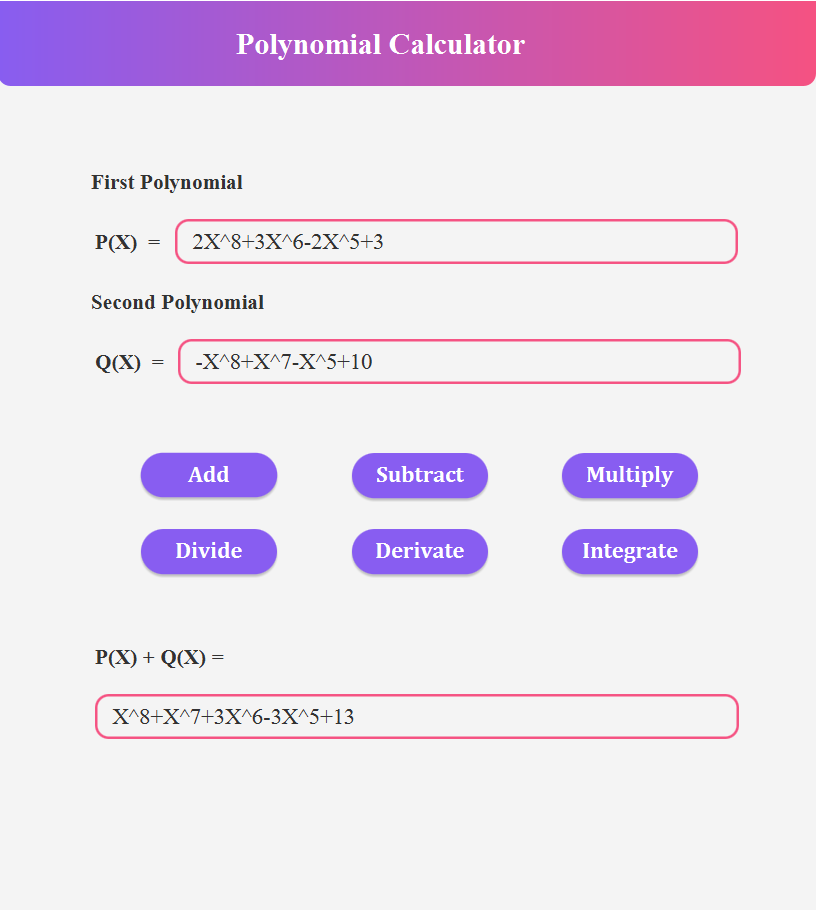
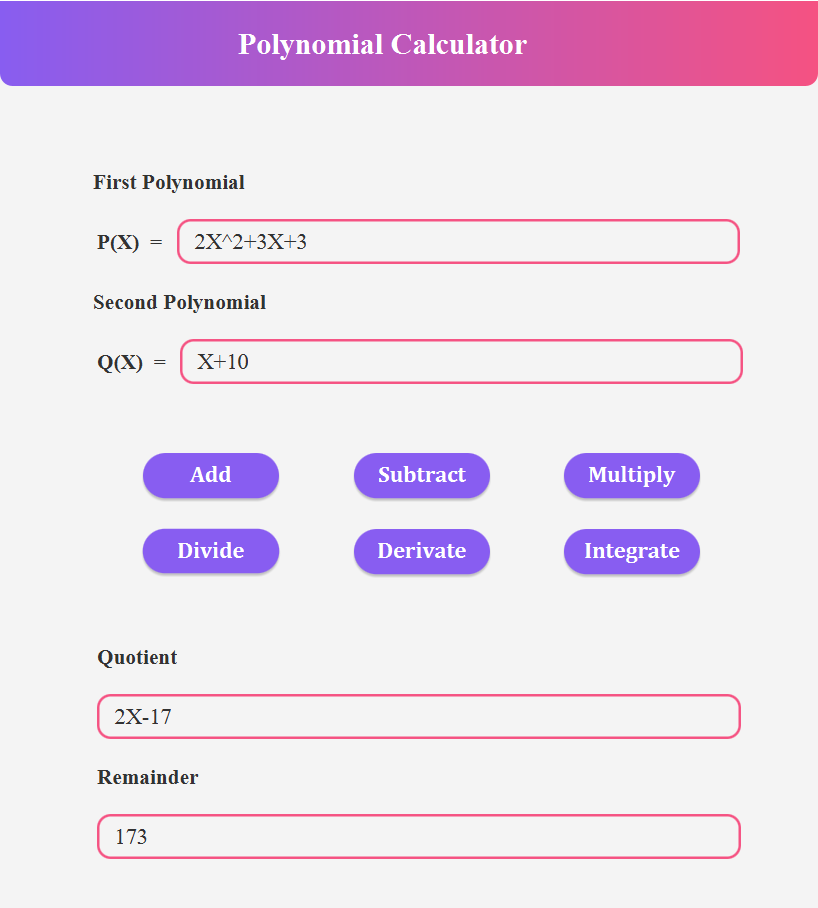
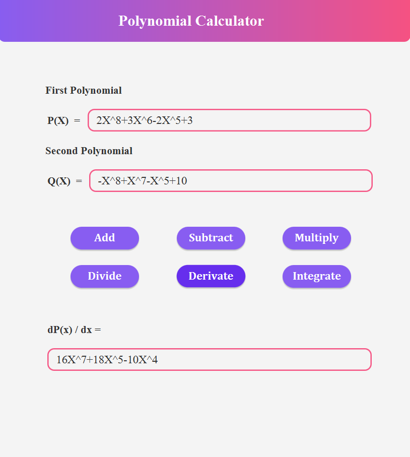
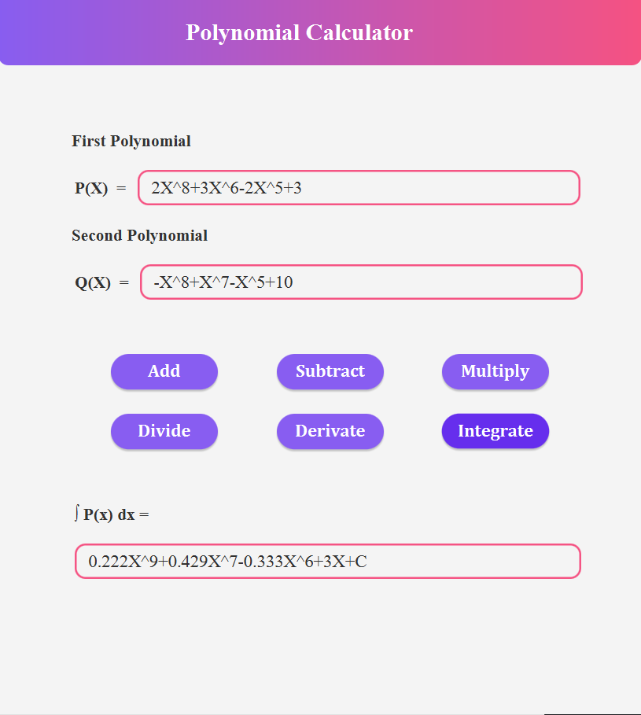

# Polynomial_Calculator

## Overview
This Polynomial Calculator is a simple tool designed to perform various operations on polynomials. It supports six operations: addition, subtraction, multiplication, division, differentiation, and integration.

## Supported Operations
1. **Addition:** Add two polynomials.

2. **Subtraction:** Subtract one polynomial from another.

3. **Multiplication:** Multiply two polynomials.

4. **Division:** Divide one polynomial by another.

5. **Differentiation:** Find the derivative of a polynomial.

6. **Integration:** Find the indefinite integral of a polynomial.

## Usage
1. **Input Format:** The calculator accepts polynomials in standard format. For example, "3x^2 + 2x - 5".
2. **Operations:** Choose the desired operation from the menu.
3. **Input Polynomials:** Enter the polynomials on which you want to perform the operation.
4. **Result:** The calculator will display the result of the operation.

## Example
### Addition
